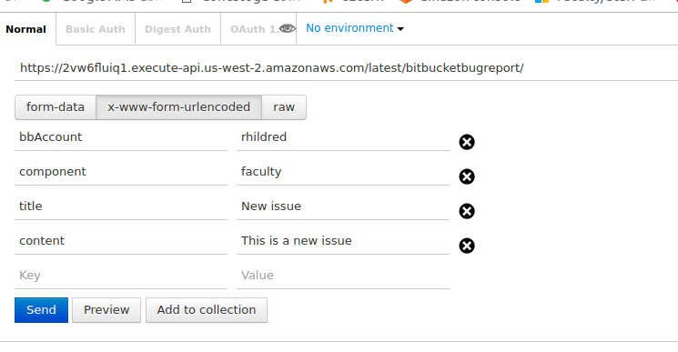

Android logcat on to bitbucket issue
===

This is built to submit an issue on bitbucket from an android application. It uses a special bitbucket user, `ysaasissues`, and a web service, `https://rich-hildred.rhcloud.com/BitBucket`, to actually submit the issue. You can see a screen shot of the parameters here:



The actual java setup code ooks like this:

```
    URL url;
    String targetURL = "http://rich-hildred.rhcloud.com/BitBucket";
    String urlParameters =
            "title=" + URLEncoder.encode("Android Bug Report", "UTF-8") +
                    "&user=" + URLEncoder.encode("rhildred", "UTF-8") +
                    "&component=" + URLEncoder.encode("testingandroiderrors", "UTF-8") +
                    "&bbAccount=" + URLEncoder.encode("rhildred", "UTF-8") +
                    "&content=" + URLEncoder.encode(log.toString(), "UTF-8");
    //Create connection
    url = new URL(targetURL);
    
```

Of course we had to get the logcat output first. To do this we used this code:

```

    Process process = Runtime.getRuntime().exec("logcat -d");
    BufferedReader bufferedReader = new BufferedReader(
            new InputStreamReader(process.getInputStream()));

    StringBuilder log = new StringBuilder();
    String line = "";
    while ((line = bufferedReader.readLine()) != null) {
        log.append(line + "\n");
    }

```

All of the code is in com.murach.TipCalculatorActivity.java. I also thought that it would be helpful to create a class with a static `LogcatBugReport.send(...)` method and add it to my maven repository. More to come on that.